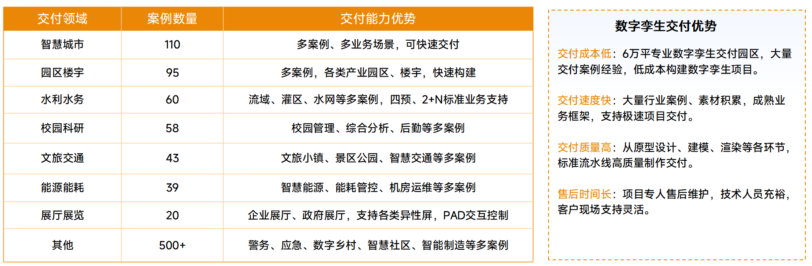
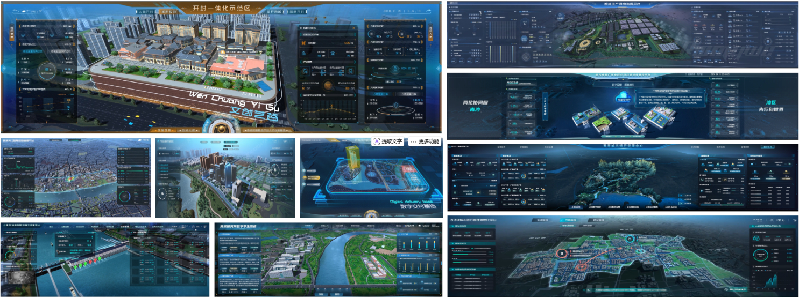
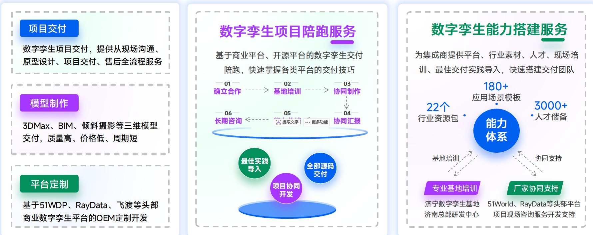
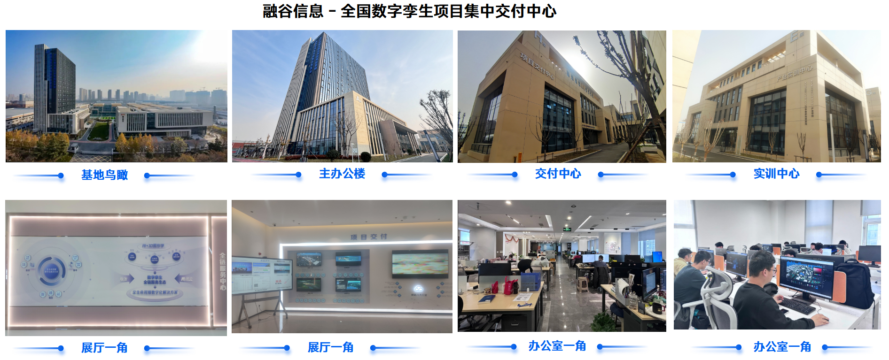

# 数字孪生交付行业领军企业————山东融谷信息

## 一、公司介绍

山东融谷信息科技有限公司，成立于 2018 年，总部位于山东济南，是目前数字孪生领域规模最大的专注数字孪生项目交付企业。融谷信息在数字孪生领域已经构建了一套独具特色的交付与落地新格局，其核心在于从传统的项目定制化开发，升级为一种更高效、可复用、深度赋能业务的新模式。融谷信息与多个头部数字孪生平台公司建立项目交付合作，在济南、东营、济宁等地共建多个数字孪生产研教学基地保证项目交付。公司拥有数字孪生交付工程师200余人、模型师800余人，从项目前期支撑、开发、实施、售后等环节形成闭环交付。成立以来，与多个头部数字孪生平台公司建立项目外包合作，基于商业平台(RayData、51World、优锘、飞渡等)、Unity3D引擎、UE引擎、倾斜摄影等，成功交付各行业数字孪生项目350+，交付成本低、交付周期短，欢迎到访考察洽谈合作。

## 二、核心业务布局

公司核心聚焦数字孪生技术落地，已交付各行业相关项目350+，同时布局多类合规经营业务：

‌**数字孪生行业解决方案**‌：覆盖水利、智能制造、教育、医疗、文旅、园区六大领域，依托RayData、Unity3D、UE引擎等技术，为客户提供三维可视化全流程服务，可实现设备实时监测、流程模拟优化等功能，助力行业数字化转型。

‌**产教融合服务**‌：与多所高校共建数字艺术产业学院，参编高校数字孪生系列教材，2026年相关案例入选全国职业教育产教融合创新实践案例，打通教育链与产业链，为数字经济领域培养专业技术人才。

‌**其他合规经营业务**‌：包含信息系统集成、软硬件开发销售、企业管理咨询、广告设计发布、人力资源服务等，持有广播电视节目制作经营许可证、ISO9001质量管理体系认证等多项资质，保障业务合规开展。

## 三、企业核心优势

‌**全技术覆盖**‌：整合主流商业平台与自研工具，拥有成熟的项目交付流水线，可实现低成本、高效率的项目落地，配套长期专人售后支持。

‌**资质与知识产权储备**‌：布局多项数字孪生相关专利、35个软件著作权，持有21个注册商标，覆盖科技服务、教育娱乐等多个业务领域，技术实力扎实。

‌**产业生态完善**‌：依托母公司的资源布局，联动高校、产业园区、上下游企业，形成了“人才培养-技术研发-项目落地”的完整产业闭环。

